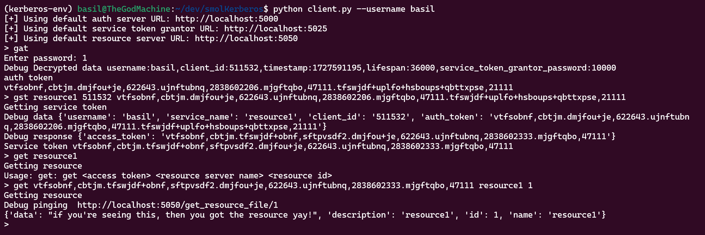

# smolKerberos - Implementing KerberosV4 from scratch

This repo implements Kerberos from scratch in Python. This is a toy implementation for learning and should not be used for production. Check out the [blogpost][0] for more details. This application implements the idea in this [paper][1].


## Metadata

* New resource created response from auth server 

{
    "data": {
        "data": "if you're seeing this, then you got the resource yay!",
        "description": "resource1",
        "id": 1,
        "name": "resource1"
    },
    "status": "Resource added successfully"
}

* New user created response from auth server

{
    "data": {
        "id": 1,
        "name": "basil"
    },
    "status": "User added successfully"
}


## How to run

run resource server 
```
python resource_server.py --name resource1 --password 11 --port 5050
```

run auth token grantor server
```
python authentication_token_grantor.py --name auth --port 5000
```

run service token grantor server 
```
python service_token_grantor.py --name service_token --port 5025
```

(hoping that user and resource are already pre-populated)

### Typical client workflow

```
python client.py --username basil
> gat 
Enter password:
..auth token
> gst <resource_name> <client_id> <auth_token>
..service token
> get <resource_name> <resource_id> <service_token>
...
```

## version 3


The ticket-owner gets the session key as part of the reply from Charon. Like this:
She scrawls the following on a chalkboard:

 CHARON REPLY  -  [sessionkey|ticket]
The service's copy of the session key comes inside the ticket, and the service gets the key when it decrypts the ticket. So the ticket looks like this:

 TICKET -  {sessionkey:username:address:servicename:lifespan:timestamp}
When you want to get to a service, the client program you start builds what I call an AUTHENTICATOR. The authenticator contains your name and your workstation's address. The client encrypts this information with the session key, the copy of the session key you received when you requested the ticket.

  AUTHENTICATOR - {username:address} encrypted with session key
After building the authenticator, the client sends it and the ticket to the service. The service cannot decrypt the authenticator yet because it doesn't have the session key. That key is in the ticket, so the service first decrypts the ticket.

After decrypting the ticket, the service ends up with the the following information:

The ticket's lifespan and timestamp;
The ticket-owner's name;
The ticket-owner's network address;
The session key.
The service checks to see if the ticket has expired. If all is well in that regard, the service next uses the session key to decrypt the authenticator. If the decryption proceeds without a hitch, the service ends up with a username and a network address. The service tests this information against the name and address found in the ticket, AND the name and address of the person who sent the ticket and authenticator. If everything matches, the service has determined that the ticket-sender is indeed the ticket's real owner.


## version 2

>  inventing a new network service. It's called the "ticket-granting" service, a service that issues Charon tickets to users who have already proven their identity to Charon. You can use this ticket-granting service if you have a ticket for it, a ticket-granting ticket.

The ticket-granting service is really just a version of Charon in as much as it has access to the Charon database. It's a part of Charon that lets you authenticate yourself with a ticket instead of a password.

Anyhow, the authentication system now works as follows: you login to a workstation and use a program called kinit to contact the Charon server. You prove your identity to Charon, and the kinit program gets you a ticket-granting ticket.

Now say you want to get your mail from the mail server. You don't have a mail server ticket yet, so you use the "ticket-granting" ticket to get the mail server ticket for you. You don't have to use your password to get the new ticket.

> Once you have acquired a ticket-granting ticket, you don't need to get another. You use the ticket-granting ticket to get the other tickets you need.

---

> Charon uses the username to look up your password. Next Charon builds a packet of data that contains the ticket-granting ticket. Before it sends you the packet, Charon uses your password to encrypt the packet's contents.

Your workstation receives the ticket packet. You enter your password. Kinit attempts to decrypt the ticket with the password you entered. If kinit succeeds, you have successfully authenticated yourself to Charon.

---

Tokens still prone to REPLAY attacks as service tokens are not expirable

> make all tokens, access and service tokens to be expirable 

> there's still the issue of REPLAY attacks before the expiration if an adversary gets access to the tokens before the expiration.

Client workflow for version 2



## version 1

In an open network environment, machines that provide services must be able to confirm the identities of people who request service. If I contact the mail server and ask for my mail, the service program must be able to verify that I am who I claim to be

# Major issues
1. ~~user experience - have to request new ticket from charon from every new service i use. reusability is still possible for the same service.~~ version 2 addresses these issues
2. ~~each time i request a new ticket, my password is sent over (possibly compromised) network in cleartext. not good!~~ version 2 addresses these issues


# Simplications made
1. ~~There is no network identifier. This will be auto-assigned to each user client and used in the access token along with username and service_name.~~ Added a barebone client program which randomly generates a client_id to simulate the idea of an immutable network identifier.
2. The password is an int (for sake of this demo)
3. Ideally, the stesp to get auth token and then service access token for any service will be abstracted away / hidden from the user but for simplicity (and understanding), those are made explicit in the client program.
4. Leaving testing the token expire workflow. Ideally, the client should be smart enough to detect a token expired exception and reinitiate a fresh request to the auth and service token grantor servers.
5. The session key management on the client side is a nightmare. Ideally, the client will nicely book keep the auth session key and all service session keys to abstract those operations.
6. The encryption scheme is laughably easy to break. I mean if you stare long enough at the ciphertext, you'll probably be able to make out what the cleartext it. 
7. Leaving out the authenticator timestamp feature. But given the current code, it should be straightforward to implement. Ideally, the lifespan of an authenticator would be 1-2 mins. 

Format of the access token
key:value,key:value,key:value,...

Format of datapacket
token1|token2|...


## Further improvements 

1. Re-issue token service
2. Authorization layer on top of authentication layer

## References 

1. [Designing an Authentication System: A dialogue in four scenes][1]

[0]: 
[1]: https://web.mit.edu/Kerberos/dialogue.html
